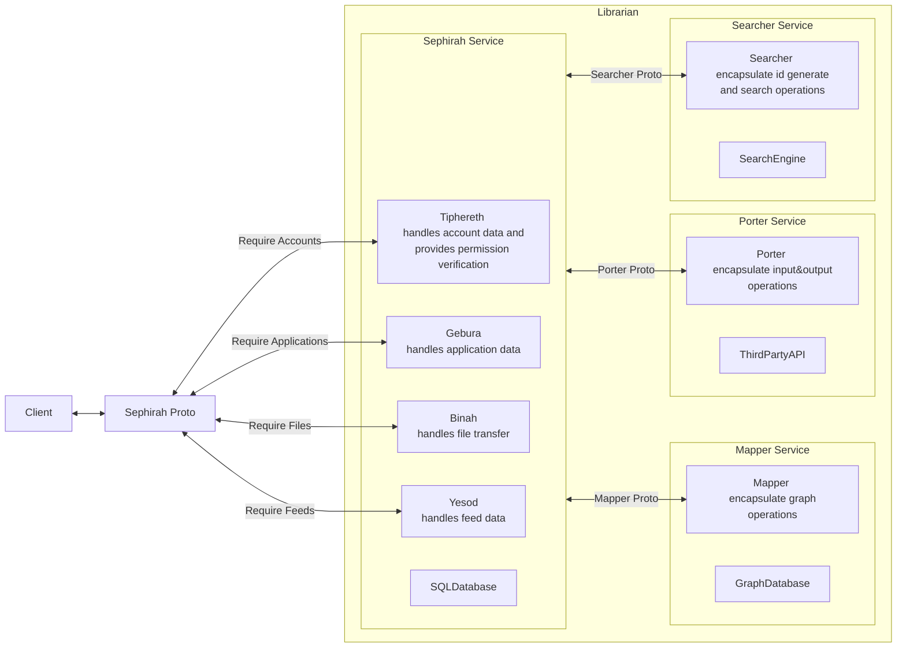

# Architecture

```mermaid
graph LR
    subgraph Librarian
        subgraph Sephirah[Sephirah Service]
            Tiphereth[Tiphereth \n handles account data and provides permission verification]
            Gebura[Gebura \n handles application data]
            Binah[Binah \n handles file transfer]
            Yesod[Yesod \n handles feed data]
            SQLDatabase
        end
        subgraph Mapper Service
            Mapper[Mapper \n encapsulate graph operations]
            GraphDatabase
        end
        subgraph Porter Service
            Porter[Porter \n encapsulate input&output operations]
            ThirdPartyAPI
        end
        subgraph Searcher Service
            Searcher[Searcher \n encapsulate id generate and search operations]
            SearchEngine
        end
        Sephirah <-->|Mapper Proto| Mapper
        Sephirah <-->|Porter Proto| Porter
        Sephirah <-->|Searcher Proto| Searcher
    end
    Proto[Sephirah Proto]
    Proto <-->|Require Accounts| Tiphereth
    Proto <-->|Require Applications| Gebura
    Proto <-->|Require Files| Binah
    Proto <-->|Require Feeds| Yesod
    Client <--> Proto
```
