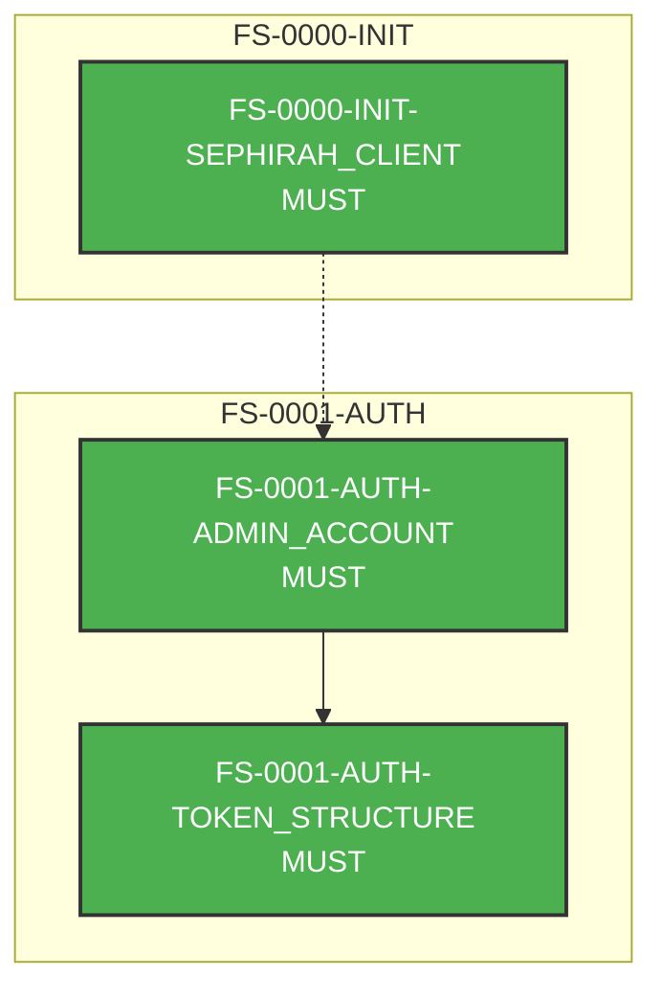

# AGENTS.md - Feature Sets

## Overview

This directory contains Feature Sets documentation for the TuiHub platform. Feature Sets (FS) are behavior specifications that define system requirements and their corresponding test implementations.

## What are Feature Sets?

Feature Sets describe collections of related features using:
- **Markdown files** (`.md`): Human-readable specifications following RFC 2119 (MUST, SHOULD, MAY)
- **Go test files** (`.go`): Executable test cases that validate the specifications
- **Test suite**: A comprehensive test runner that validates implementations against specs

## File Structure

```
docs/feature_sets/
├── AGENTS.md              # This file
├── FS_overview.md         # General writing guide
├── FS_testsuite.go       # Test suite framework
├── FS_testsuite_test.go  # Test suite entry point
├── FS-XXXX-SCOPE.md      # Specification document
└── FS-XXXX-SCOPE.go      # Test implementation
```

## Writing Feature Set Specifications

### Naming Convention

**Feature Set Document ID Format:**
```
FS-<incremental-number>-<feature-scope>
```

**Feature Definition ID Format:**
```
FS-<incremental-number>-<feature-scope>-<feature-name>
```

- Use uppercase for scope and feature names
- Separate multiple words with underscores: `TOKEN_STRUCTURE`, `GRPC_AUTHENTICATION`
- Numbers are zero-padded to 4 digits: `FS-0001`, `FS-0042`

### Document Template

Create new specification files with this structure:

```markdown
---
id: FS-XXXX-SCOPE
title: Brief title
version: 0.0.1
status: draft
created: YYYY-MM-DD
last_updated: YYYY-MM-DD
---

## FS-XXXX-SCOPE-FEATURE_NAME

Description of the feature requirement using RFC 2119 keywords:
- MUST: Absolute requirement
- SHOULD: Strong recommendation
- MAY: Optional feature

Additional details and context.

## FS-XXXX-SCOPE-ANOTHER_FEATURE

Next feature definition...
```

### Example

See [FS-0001-AUTH.md](FS-0001-AUTH.md) for a complete example covering token validation behavior.

## Implementing Test Cases

### Test Case Structure

Each feature definition in the markdown file should have a corresponding test case in the `.go` file.

```go
package featuresets

import (
    "context"
    pb "github.com/tuihub/protos/pkg/librarian/sephirah/v1"
)

func init() {
    registerTestCase("FS-XXXX-SCOPE-FEATURE_NAME", must, func(ctx context.Context, g *globals) error {
        // Test implementation
        // Return error if test fails, nil if passes
        return nil
    }, withDependOnIDs("FS-YYYY-DEPENDENCY"))
}
```

### Test Case Components

1. **ID**: Must match the feature definition ID from markdown
2. **Require Level**: 
   - `must`: For MUST requirements (mandatory)
   - `should`: For SHOULD requirements (recommended)
   - `may`: For MAY requirements (optional)
3. **Test Function**: Implements the actual test logic
4. **Dependencies**: Optional list of test IDs that must pass first

### Test Case Validation

- Test case IDs MUST match pattern: `^FS-[0-9]{4}-[A-Z]+-[A-Z_]+$`
- Test cases are automatically sorted by dependencies before execution
- Failed dependencies will affect dependent tests

## Running Tests

### Available Commands

The testsuite provides two main commands:

```bash
# From the repository root

# Run the test suite (default command)
go run ./cmd/testsuite run --server-host=localhost --server-port=8080

# Generate dependency tree visualization
go run ./cmd/testsuite tree

# Show help
go run ./cmd/testsuite help
```

### Local Testing

```bash
# From the repository root

# Run the test suite against a server (explicit)
go run ./cmd/testsuite run --server-host=localhost --server-port=8080

# Run with default parameters (127.0.0.1:10000)
go run ./cmd/testsuite run

# Backward compatible - omitting 'run' defaults to run command
go run ./cmd/testsuite --server-host=localhost --server-port=8080

# Run with verbose output
go run ./cmd/testsuite run --server-host=localhost --server-port=8080 -vv
```

### Verbose Levels

- `0` (default): Summary only (pass/fail counts by requirement level)
- `1` (`-v`): Show test results
- `2` (`-vv`): Show detailed test execution
- `3` (`-vvv`): Extremely verbose output

### Test Output

```
Running test case: FS-0001-AUTH-TOKEN_STRUCTURE
  PASSED
Running test case: FS-0001-AUTH-GRPC_AUTHENTICATION
  PASSED
...

MUST Cases    5/5
SHOULD Cases  3/4
MAY Cases     2/3
```

### Visualizing Dependencies

Generate a Mermaid diagram showing test case dependencies:

```bash
# From the repository root

# Output to terminal
go run ./cmd/testsuite tree

# Save to file
go run ./cmd/testsuite tree > dependency-tree.md
```

The tree command generates:
- **Mermaid diagram**: Visual representation of test dependencies organized by Feature Set scope
- **Subgraphs**: Each Feature Set (FS-XXXX-SCOPE) is displayed in its own subgraph
- **Edge styles**: 
  - Solid arrows (`-->`) for dependencies within the same Feature Set
  - Dashed arrows (`-.->`) for dependencies across different Feature Sets
- **Statistics**: Test counts by requirement level, per-FS breakdown, max depth, root/leaf nodes
- **Color coding**: 
  - 🟢 Green = MUST requirements
  - 🔵 Blue = SHOULD requirements
  - 🟡 Yellow = MAY requirements

**Example tree output:**



## Dependency Tree Statistics

- **Total test cases**: 3
- **MUST**: 3 cases (100.0%)
- **Maximum depth**: 3 levels
- **Root nodes**: 1
- **Leaf nodes**: 1

### Test Cases by Feature Set

- **FS-0000-INIT**: 1 cases
- **FS-0001-AUTH**: 2 cases

### Dependencies

- **Same-FS dependencies**: 1
- **Cross-FS dependencies**: 1
- **Total dependencies**: 2 (50.0% cross-FS)

## Development Workflow

### Adding a New Feature Set

1. **Choose an ID**:
   ```bash
   # Find the next available number
   ls FS-*.md | sort | tail -1
   # Use next incremental number
   ```

2. **Create specification**:
   ```bash
   touch FS-XXXX-SCOPE.md
   ```

3. **Write specification** following the template above

4. **Create test file**:
   ```bash
   touch FS-XXXX-SCOPE.go
   ```

5. **Implement test cases** for each feature definition

6. **Test locally**:
   ```bash
   cd /path/to/protos
   go run ./cmd/testsuite run --server-host=your-test-server --server-port=port
   ```

7. **Visualize dependencies** (optional):
   ```bash
   go run ./cmd/testsuite tree
   ```

8. **Commit both files together**

Note: The dependency tree visualization is automatically generated as `docs/dependency-tree.md` when running `make generate`. This file is used for documentation website deployment alongside `docs/protos.md` and `docs/openapi.json`.

### Modifying Existing Feature Sets

1. Update the `last_updated` date in the markdown frontmatter
2. Increment the `version` if making significant changes
3. Ensure test implementation matches the specification
4. Test all affected cases locally
5. Update dependent test cases if needed

### Best Practices

- **One feature per definition**: Keep feature definitions atomic
- **Clear test names**: Test case IDs should be self-descriptive
- **Meaningful errors**: Return descriptive error messages from test functions
- **Use dependencies**: Leverage `withDependOnIDs()` to establish test order
- **Visualize complex dependencies**: Use `testsuite tree` to understand test relationships
- **Test isolation**: Each test should clean up after itself when possible
- **Update docs**: Keep markdown specs synchronized with test implementation

## Test Suite Framework

### Global Context

The `globals` struct maintains shared state across test cases:

```go
type globals struct {
    SephirahServerHost string
    SephirahServerPort int
    SephirahClient     pb.LibrarianSephirahServiceClient
    AccessToken        string
    RefreshToken       string
    // Add more shared state as needed
}
```

### Helper Functions

Common helper functions are available:

- `withBearerToken(ctx, token)`: Add authorization header to context
- `withDependOnIDs(ids...)`: Specify test dependencies
- `registerTestCase()`: Register a new test case

### Adding Shared State

When features require shared state:

1. Add fields to `globals` struct in [FS_testsuite.go](FS_testsuite.go)
2. Initialize in early test cases (like `FS-0000-INIT-*`)
3. Access in dependent test cases via the `g *globals` parameter

## Code Style Guidelines

### Go Test Code

- **Package**: Always use `package featuresets`
- **Imports**: Import proto packages as `pb "github.com/tuihub/protos/pkg/..."`
- **Error handling**: Always check and wrap errors with context
- **Formatting**: Use `gofmt` before committing
- **Comments**: Document complex test logic

### Markdown Specifications

- **Headers**: Use `##` for feature definitions
- **Keywords**: Use RFC 2119 keywords (MUST, SHOULD, MAY) in **bold**
- **Code**: Use backticks for technical terms and code
- **Lists**: Use `-` for bullet points
- **Examples**: Include examples when helpful

## Common Patterns

### Authentication Setup

```go
registerTestCase("FS-XXXX-SCOPE-AUTH_REQUIRED", must, func(ctx context.Context, g *globals) error {
    ctx = withBearerToken(ctx, g.AccessToken)
    // Make authenticated call
    resp, err := g.SephirahClient.SomeMethod(ctx, req)
    // ...
}, withDependOnIDs("FS-0001-AUTH-TOKEN_STRUCTURE"))
```

### Checking Response Structure

```go
if resp.Field == "" {
    return fmt.Errorf("expected field to be non-empty")
}
if len(resp.Items) == 0 {
    return fmt.Errorf("expected at least one item")
}
```

### Testing Error Cases

```go
_, err := g.SephirahClient.SomeMethod(ctx, invalidReq)
if err == nil {
    return fmt.Errorf("expected error for invalid request")
}
// Optionally check error type/message
```

## Integration with CI/CD

The test suite can be integrated into CI pipelines:

```bash
# In CI environment
cd docs/feature_sets
go test -v -timeout 5m
```

Set up test environment variables:
- `SEPHIRAH_HOST`: Server hostname (default: localhost)
- `SEPHIRAH_PORT`: Server port (default: varies)

## Troubleshooting

### Test case ID format error

```
Test case ID FS-001-AUTH format is invalid
```
**Fix**: Ensure ID uses 4-digit zero-padded numbers: `FS-0001-AUTH`

### Circular dependency detected

```
Error: circular dependency in test cases
```
**Fix**: Review `withDependOnIDs()` calls and remove circular references

### Test hangs

**Possible causes**:
- Server not responding
- Network timeout
- Test logic has infinite loop

**Fix**: 
- Verify server is running and accessible
- Add timeout to context
- Review test implementation

### Compilation errors

```
undefined: pb.SomeMethod
```
**Fix**: 
- Ensure proto files are generated: `cd ../.. && make generate`
- Check import paths in test file
- Verify proto definition exists

## Related Documentation

- [FS_overview.md](FS_overview.md): Writing guide overview
- [Main AGENTS.md](../../AGENTS.md): Root project documentation
- [Proto definitions](../../proto/librarian/): Service proto files
- Test suite implementation: [FS_testsuite.go](FS_testsuite.go)

## Contributing

When contributing Feature Sets:

1. Follow the naming conventions strictly
2. Write clear, testable specifications
3. Implement comprehensive test coverage
4. Test locally before submitting PR
5. Update this guide if adding new patterns

## Questions?

- Check existing Feature Sets for examples: [FS-0001-AUTH.md](FS-0001-AUTH.md), [FS-0002-USER.md](FS-0002-USER.md)
- Review [FS_testsuite.go](FS_testsuite.go) for framework details
- Refer to RFC 2119 for keyword definitions: https://www.ietf.org/rfc/rfc2119.txt
