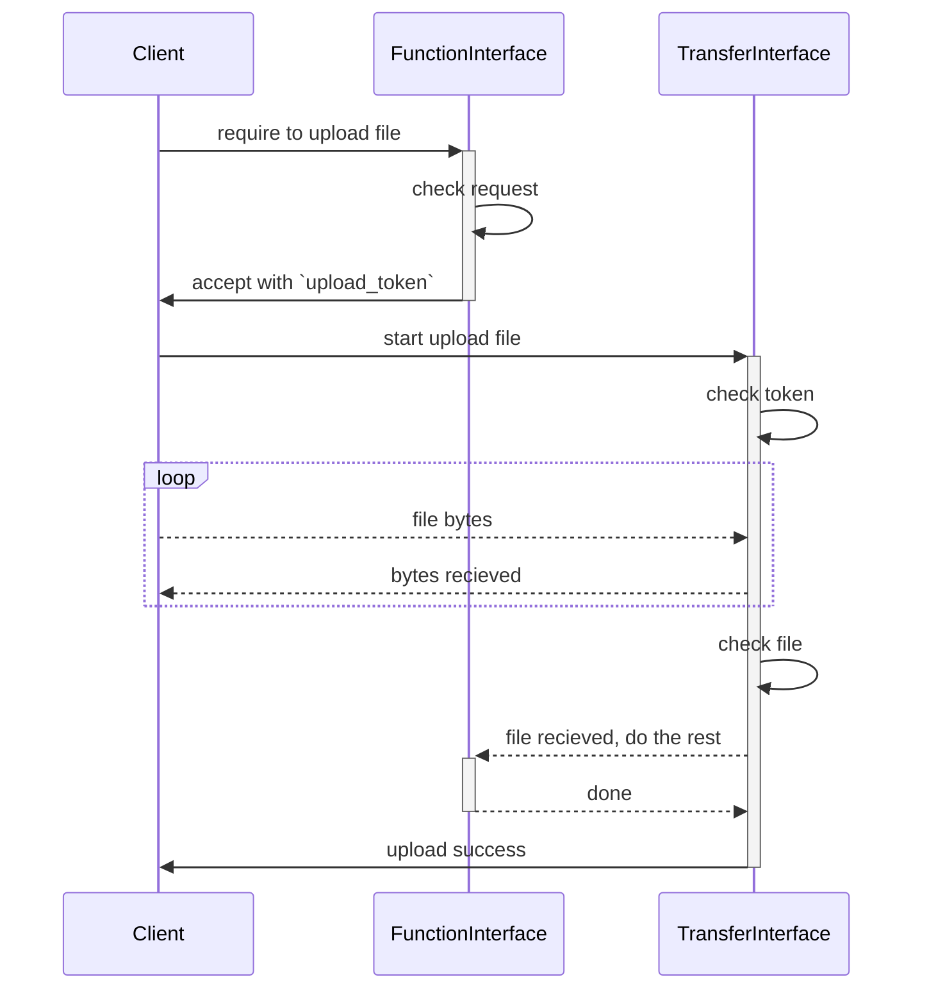
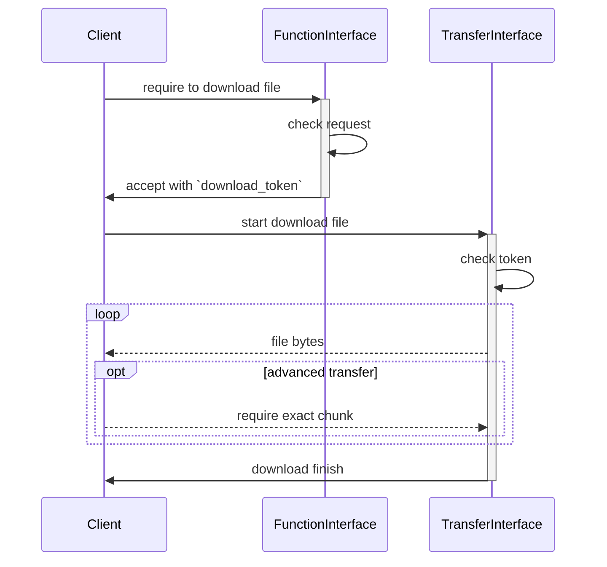

## 通用信息

系统结构介绍

- `Librarian` 服务端
  - `Sephirah` 核心逻辑，`Librarian`的访问入口，不会向外部系统发出连接
  - `Mapper` 图数据库封装
  - `Porter` 外部系统接口封装
  - `Searcher` 搜索引擎封装
- `Waiter` 客户端
- `Sentinel` 监控端，用于特定功能

## 用户与账户（Tiphereth）

*用户指本系统内能够登录的角色；账户指第三方系统中的用户*  

涉及页面：登录、用户管理、账户管理

### 用户权限

权限设计使用简单的硬编码的“用户-角色-权限”结构

用户分`Admin`、`Normal`、`Sentinel`三种角色：
- `Admin` 能够访问除个人敏感数据外的所有数据
- `Normal` 能够访问自己的和其他人公开的数据
- `Sentinel` 扫描器专用，仅能访问非常有限的接口

### 用户鉴权

#### 认证流程

认证采用双token机制，`access_token`用于每次调用的鉴权，`refresh_token`用于续期

- 除登录接口外的接口，除特殊规定，均需要`access_token`
- 在需要认证的请求中设置 Bearer Token，值为该接口要求使用的token
- 【**需要考虑Web平台的安全性**】客户端可以持久化储存token，但不应尝试解析token

##### 客户端

1. 客户端通过`GetToken`接口获取`access_token`和`refresh_token`。`access_token`的有效期大约为几个小时，`refresh_token`的有效期大约为几天，客户端不需要关心准确的过期时间
2. 客户端使用`access_token`访问其他接口
3. 【**需确认实现难度**】若服务端因`access_token`过期拒绝访问接口，则客户端通过`RefreshToken`接口获取新的`access_token`和`refresh_token`
4. 若服务端因`refresh_token`过期拒绝给出新token，则客户端回到第一步。若成功获取到新token，则客户端回到第二步
- 提前调用`RefreshToken`接口不会使旧的`access_token`立即失效，但更旧的`access_token`可能立即失效（根据服务端的安全策略而定）

##### 服务端

JWT是一个token生成规范，是通过将一个包含数字签名的明文json序列化生成的，服务端依靠数字签名保证其不可伪造。服务端所有种类的token都通过jwt生成，遵循以下要求

- jwt是明文，所以不应包含敏感信息
- `access_token` 可以不在服务端存储，token中需要设置字段以使服务端能够识别用户和token有效期
- `refresh_token` 必须在服务端存储，使用时以服务端存储的数据为准，token中只需要设置必要的字段
- 由于jwt中的json没有字段规范，任何功能都不应依赖于让客户端解析jwt中的字段

#### 安全性

##### 暴力破解

- 登录接口需要通过必要的手段防止暴力破解，由于系统设计是私有化部署，可以选择封禁ip等较激进的措施
- 其他接口由于只需要通过计算验证签名即可验证token的有效性，验证过程不需要访问存储服务，所以可以有效地保护

##### 中间人攻击

- 强制使用tls加密连接，可以避免大多数的攻击
- `access_token` 由于每次传输都会携带，所以最有可能泄露，但其有效期短，且不能用于生成新token，造成的影响有限
- `refresh_token` 由于是在服务端存储，仅能使用一次，若泄露后到用户刷新token这段时间内没有被使用，则token失效；若被使用了，则用户能够从服务端得知可能存在泄露

### 用户管理（User）

系统初始必须有一个可用的`Admin`用户，用户权限如下：

- `Admin` 能够管理包括其他`Admin`在内的所有用户，不同`Admin`之间不设保护
- `Normal` 能够管理自己（复用或设计单独的页面）。能够创建和管理自己的`Sentinel`
- `Sentinel` 没有任何权限

任何密码修改操作都必须携带被修改账号的原密码

### 账户管理（Account）

*绑定账户的用途会在需要的时候介绍*

系统初始没有账户信息，账户信息有两种来源，只有系统支持该平台以后才能绑定

1. 用户通过绑定生成的账户信息
2. 系统在自动化收集信息时自动创建的账户信息

一个平台的一个账户只能同时绑定一个用户，一个用户每个平台最多绑定一个账户。
绑定时系统不验证用户与账户的同一性，目前阶段用户禁止绑定第二种来源生成的账户

解绑只删除绑定关系，不删除账户数据

用户权限：
- `Admin`、`Normal`均可绑定与解绑账户

## 文件传输（Binah）

*所有需要传输二进制文件的接口均由此模块完成实际的传输工作*

收发接口通过`upload_token`和`download_token`鉴权，遵循以下要求

- 两种token由其他接口生成，生成token时服务端已得知待传输文件的名称大小等信息，服务端能够通过token得知这些信息
- 两种token有效期不应过长，`upload_token`在上传成功后立即失效，`download_token`不限制下载次数
- 在上传时，上传接口能够根据token信息实现服务端的后续逻辑

### 上传



### 下载



## 游戏商店（Gebura）

*基本功能与steam等游戏商店相同，以游戏为主软件工具为辅*

涉及页面：商店、库存、游戏文件管理、游戏存档管理（可能会在同一个页面上，以实际UI设计为准）

### 游戏信息（App）

有以下两种来源：

- 用户手动填写的 `InternalApp`
- 系统自动收集的 `ExternalApp`
  - 例如：用户绑定Steam账户后，系统自动获取该Steam账户拥有的游戏并将游戏信息存入系统
  - 【**需细化**】在系统新增了与游戏有关的内容时尝试自动匹配

`App`仅存储游戏的基本信息，这里主要需要解决不同来源的游戏信息的匹配问题：
`InternalApp`和`ExternalApp`都各自存入数据库中，然后通过自动或手动的方式进行绑定（类似于前文中用户与账户的关系）。
对于拥有绑定关系的`App`，客户端需要合并为同一个`App`显示。在合并时，通过固定优先级或用户自定义优先级的方式选择显示哪个来源的App的信息

一个`ExternalApp`最多绑定一个`InternalApp`，一个`InternalApp`每个平台最多绑定一个`ExternalApp`。

用户权限：
- `ExternalApp`的信息禁止编辑
- `Normal`和`Sentinel`可以通过其他操作触发系统的自动行为
- `InternalApp`的编辑、绑定关系的编辑仅限`Admin`

### 游戏文件（AppPackage）

有以下两种来源：

- 用户手动填写
- Sentinel 上报（不涉及客户端，将在Sentinel部分详细解释）

`AppPackage`存储了一个游戏文件的信息，这些信息指向一个具体的二进制文件或“最新版本”，
但系统内并不会存储这个文件，所以无法保证文件的可访问性。  
`App`与`AppPackage`是一对多的关系，每个`AppPackage`最多从属于一个`App`，多个`AppPackage`表示一个`App`的具有多个版本

用户权限：
- 所有用户均可拥有自己的`AppPackage`，可以绑定到任意一个`InternalApp`上
- `Admin`和`Normal`能够管理自己创建的`Sentinel`拥有的`AppPackage`
- `Admin`和`Normal`具有同等权限，不可管理他人的`AppPackage`

### 时长统计(AppPackageRunTime)

- 客户端记录每个`AppPackage`的运行时间，每次运行生成一条`AppPackageRunTime`信息，包含原始启动及关闭时间， 记录的准确性完全依靠客户端维护及验证，服务端不做任何校验  
- 服务端在`App`及`AppPackage`维度上统计总时长、最后启动时间

用户权限：
- `Admin`和`Normal`能够增加或删除自己的`AppPackageRunTime`，不能修改

### 游戏存档（AppPackageSaveFile）

#### 服务端

- 一份存档为一个有效的zip文件，上传时服务端进行文件大小和checksum检查，但不检查文件内容
- 除二进制文件外，还需要储存每份存档的生成时间、checksum等基本信息
- 对于每个用户的每个`AppPackage`，支持有限数量的滚动存档，上传时只能上传一份新存档，自动覆盖最旧的备份，下载时不设限制。删除旧存档时，可以仅删除二进制文件但保留基本信息
- 对于每个用户的每个`AppPackage`，支持有限数量的固定存档，可以将任意可用的滚动存档设为固定存档，设置后即使滚动存档被覆盖，仍然可以通过固定存档入口获取

#### 客户端

- 滚动存档
  - 支持启动游戏前检查存档更新，游戏关闭后上传存档
  - 【**需确认可行性**】游戏进程未正常退出时，询问用户是否上传本次存档
  - 支持下载还原
- 固定存档
  - 支持设置与下载还原

#### 待定内容

需要考虑安全性及可行性：
- ~~`AppPackage`可以有全局的特殊存档（即，所有用户均拥有只读权限），内容为全存档/修改数值的存档等~~ `AppPackage`全局存档放入对应`AppPackage`中
- `AppPackage`可以有全局存档配置文件（即，所有用户均拥有只读权限），内容为默认存档配置
- 对于相同游戏引擎（存档位置相同），全局存档配置是在每个`AppPackage`存储相同的一份，还是仅存储一个引用

需要确定打包规则：

指定固定文件名的json文件作为配置文件，打包时包括所有存档文件和此配置文件
打包时，重命名各个`Entry`对应文件/文件夹为配置中`Id`项，还原时，恢复为配置中`OriginalName`项

- 顶层为一个`Entries`对象，内容为若干存档配置对象（数组）
- 每一个存档配置包含`Id`, `Type`, `Path`, `OriginalName`, `Delete`
  - `Id`为最终打包存档中，当前存档配置对应的文件/文件夹名称
  - `Type`为当前存档配置对应的类型，可为`File`或`Folder`
  - `Path`为当前存档配置对应的文件/文件夹的真实路径
  - `OriginalName`为当前存档配置对应的文件/文件夹的原始名称
  - `Delete`为`bool`型，仅对`Type`为`Folder`的对象生效，为`true`时代表还原存档时，需要清空还原位置文件夹内容
- `Path`中统一使用正斜杠（`/`）作为分隔符
- `Path`中特殊路径
  - `.`为游戏根目录（不一定为游戏二进制所在目录）
  - `{USER_DOCUMENT}`为用户文档目录（C#中`Environment.SpecialFolder.MyDocuments`所代表路径）
  - `{USER_PROFILE}`为用户目录（C#中`Environment.SpecialFolder.UserProfile`所代表路径）
  - `{USER_SAVED_GAMES}`为用户保存的游戏目录（C#中`Environment.SpecialFolder.UserProfile`所代表路径下`Saved Games`文件夹）

【**暂定**】配置文件示例：
```json
{
  "Entries": [
    {
      "Id": 1,
      "Type": "Folder",
      "Path": "{USER_SAVED_GAMES}/WillPlus/星の乙女と六華の姉妹",
      "OriginalName": "星の乙女と六華の姉妹",
      "Delete": true
    },
    {
      "Id": 2,
      "Type": "Folder",
      "Path": "./UserData",
      "OriginalName": "UserData"
    },
    {
      "Id": 3,
      "Type": "File",
      "Path": "./BGI.gdb",
      "OriginalName": "BGI.gdb"
    }
  ]
}
```

## Feed聚合（Yesod）

*与常规的RSS阅读器类似，但更加专用，会针对具体平台优化*

涉及页面：源管理、时间线

### Feed源管理（FeedConfig）

仅支持用户手动设置  

支持两种类型的源

- 通用类型：符合RSS标准的源。即使不同用户设置了同一个url的源，服务端也要作为不同的源处理
- 专用类型：依靠服务端内置的逻辑将特定来源的信息归一化为系统内的`Feed`格式

### 获取全文

暂无计划

### Feed阅读器

UI为时间线+详情的结构（参考B站、微博、推特、GitHub等平台）

- 用户设置的所有Feed源的信息按时间顺序排列在时间线上，支持按照作者或平台过滤
- 支持显示html文本
- 【**需要论证可行性**】当同一个源的信息过多时折叠显示

## 服务端逻辑（Angela）

*这是一个抽象模块，用于集中描述服务端内部需要支持的逻辑*

待补充